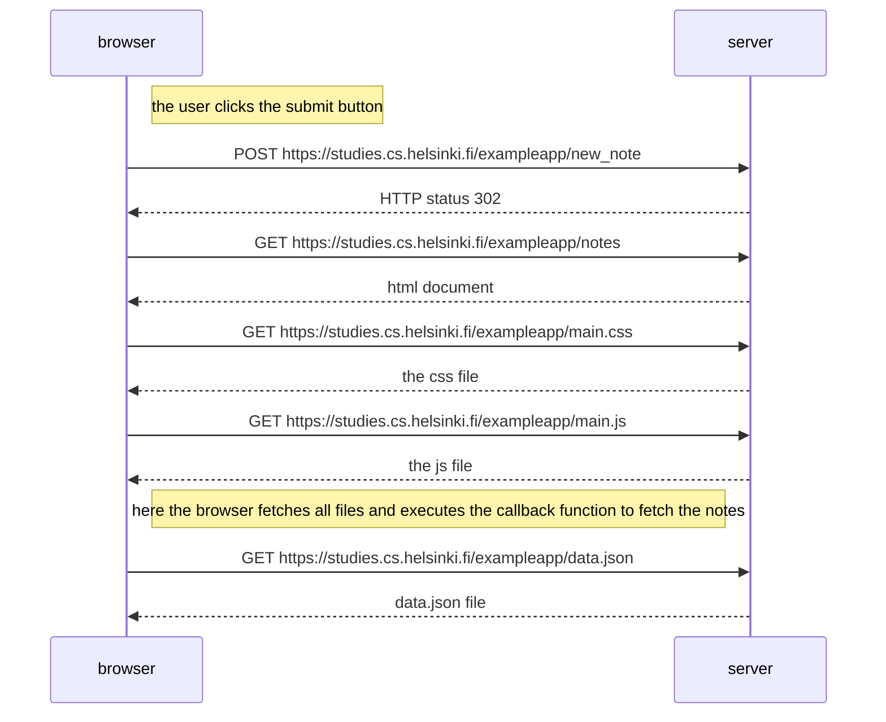

```mermaid
sequenceDiagram
    participant browser
    participant server

    Note right of browser: the user clicks the submit button

    browser->>server: POST https://studies.cs.helsinki.fi/exampleapp/new_note
    server-->>browser: HTTP status 302

    browser->>server: GET https://studies.cs.helsinki.fi/exampleapp/notes
    server-->>browser: html document

    browser->>server: GET https://studies.cs.helsinki.fi/exampleapp/main.css
    server-->>browser: the css file

    browser->>server: GET https://studies.cs.helsinki.fi/exampleapp/main.js
    server-->>browser: the js file

    Note right of browser: here the browser fetches all files and executes the callback function to fetch the notes

    browser->>server: GET https://studies.cs.helsinki.fi/exampleapp/data.json
    server-->>browser: data.json file

```