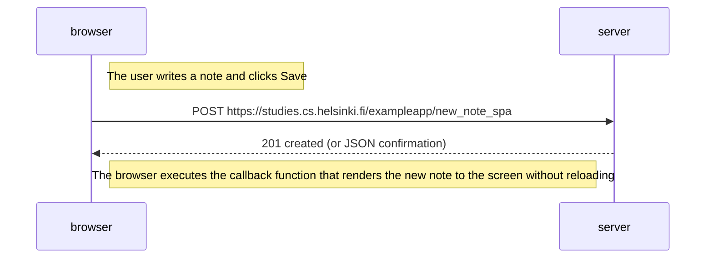

```mermaid
sequenceDiagram
    participant browser
    participant server

    Note right of browser: The user writes a note and clicks Save

    browser->>server: POST https://studies.cs.helsinki.fi/exampleapp/new_note_spa
    server-->>browser: 201 created (or JSON confirmation)

    Note right of browser: The browser executes the callback function that renders the new note to the screen without reloading
    
```